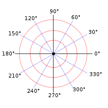

## @062 #02_sel L1 - Angulo Cartesiano - Operador Modular
## @qxcode


## Motivação

Aline: Ei André, minha vida deu uma volta de 360 graus.  
André: Vai pro colégio não tu? 360 graus volta pro mesmo lugar.  
Aline: Eu sei, é porque eu achei na rua uma carteira sem nenhum documento e cheia de dinheiro na rua.  
André: Então é 180 graus, mulher, tu agora tá estribada.  
Aline: Não, é 360 mesmo, eu levei a carteira pra casa.  
André: E?????  
Aline: Descobri que era do meu pai.

## Ação



Nosso sistema de ângulos no plano cartesiano é definido em graus. O ângulo 0 aponta para esquerda, o 90 aponta para cima, o 180 para direita e por aí vai. O 360 graus equivale voltar ao 0.  
  
Seu objetivo é transformar os ângulos para recolocá-los dentro do cartesiano. O ângulo 361 equivale ao 1. Ângulos negativos equivalem a andar no sentido horário. Por exemplo, -1 equivale ao 355.  
  
Você deve ler o ângulo e imprimir o valor correto dele dentro do cartesiano entre 0 e 355.

## Exemplos

```
>>>>>>>>
0
========
0
<<<<<<<<

>>>>>>>>
360
========
0
<<<<<<<<

>>>>>>>>
361
========
1
<<<<<<<<

>>>>>>>>
722
========
2
<<<<<<<<

>>>>>>>>
-2
========
358
<<<<<<<<

>>>>>>>>
-350
========
10
<<<<<<<<
```

#

<!---
>>>>>>>> 02
-1
========
359
<<<<<<<<


>>>>>>>> 03
362
========
2
<<<<<<<<

>>>>>>>> 04
-360
========
0
<<<<<<<<

>>>>>>>> 05
-361
========
359
<<<<<<<<

>>>>>>>> 06
750
========
30
<<<<<<<<

>>>>>>>> 07
-730
========
350
<<<<<<<<

>>>>>>>> 08
1000
========
280
<<<<<<<<

>>>>>>>> 09
-1300
========
140
<<<<<<<<
--->

### HELP

Observe que recolocar o ângulo dentro da faixa equivale a uma operação de resto da divisão, ou como dizemos em computação, uma operação de módulo. Isso equivale a remover os loops.  

0   % 360 é  0  
360 % 360 é 0  
720 % 360 é 0  
361 % 360 é 1  
730 % 360 é 10

Se o valor operado é positivo, a operação de módulo é suficiente para consertar. Se o valor é negativo, vamos precisar de uma correção.

\-1 é  359  
\-10 é 350  
\-350 é 10  
\-360 é 0  
\-370 é 350  
\-380 é 340  

A primeira coisa é recolocar remover as voltas completas, o que equivale a fazer o resto da divisão por 360. Em linguagem C, o valor sairia assim:

\-1   % 360 é -1  
\-10  % 360 é -10  
\-350 % 360 é -350  
\-360 % 360 é 0  
\-370 % 360 é -10  
\-380 % 360 é -20  

Perceba que nossos números negativos estão entre 0 e - 365. Para consertá-los, basta adicionar 360.

\-1   % 360 + 360 é 359  
\-10  % 360 + 360 é 350  
\-350 % 360 + 360 é 10  
\-360 % 360       é 0  
\-370 % 360 + 360 é 350  
\-380 % 360 + 360 é 340  

Para generalizar, nosso algoritmo fica assim.

leia angulo  
   angulo = angulo % 360  # para retirar os loops  
   se angulo < 0  
      angulo = angulo + 360 # para consertar os números negativos